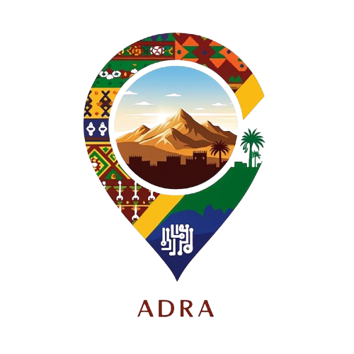
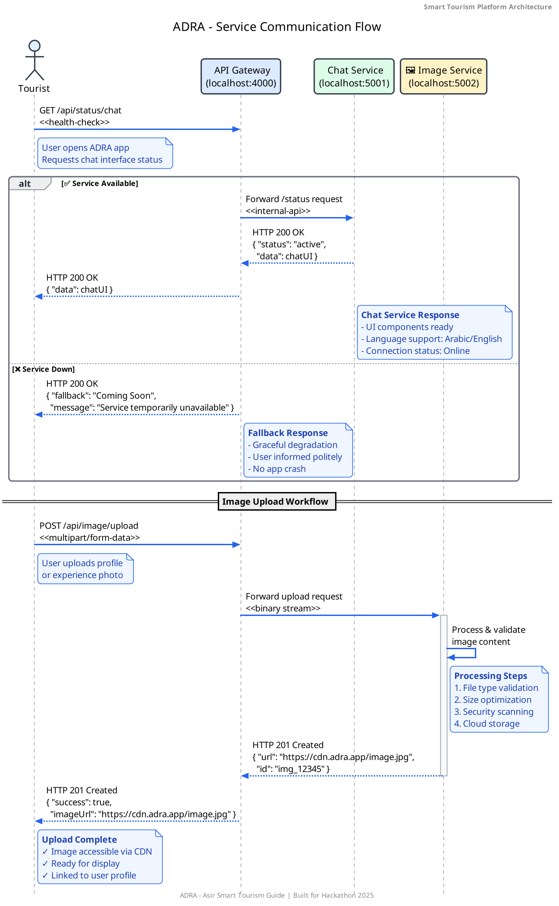

<div align="center">

  <!-- Logo and Title -->
  <p align="center">
    
  </p>
  
  <h1 align="center">ADRA</h1>
  
  <p align="center"><strong>The Future of Smart Cultural Tourism in Asir</strong></p>
  
  <!-- Badges -->
  <p align="center">
  
    <!-- External Hackathon badge using HTML -->
    <a href="https://aseertabtaker.asda.gov.sa/#hero-section" target="_blank">
      
    </a>
  
    <!-- Internal Status badge using Markdown -->
    [](#-current-status)
  
    <!-- LICENSE badge using Markdown -->
    [](LICENSE)
  
  </p>

  <p>A next-generation AI-powered tourism ecosystem connecting travelers, guides, and artisans across Asir.</p>

  <hr />
</div>

## 🌐 Overview

**ADRA** redefines cultural tourism in Saudi Arabia’s Asir region by fusing **artificial intelligence**, **hyperlocal experiences**, and **digital empowerment** for communities.

From intelligent multilingual guides to a direct marketplace for artisans, ADRA isn’t just a travel app — it’s a **sustainable tourism movement**.

> 🏛️ Built for **Asir Hackathon 2025**  
> 🎯 Mission: *Empower local voices. Elevate authentic experiences.*

---

## 🚀 Key Features

| ✨ Feature | 🔧 Technology | 🌍 Impact |
|----------|-------------|--------|
| **AI + Human Hybrid Guide** | GPT-level NLP, voice chat, contextual awareness | Smarter, personalized tours |
| **Live Translation Engine** | Real-time speech/text translation (Arabic ↔ 6+ languages) | Break language barriers |
| **Cultural Experience Booking** | Calendar API, geolocation, dynamic pricing | Promote heritage & eco-tourism |
| **Artisan Marketplace** | Secure payments, inventory API, seller dashboard | Economic inclusion for locals |
| **Smart Discovery Engine** | AI-driven recommendations based on weather, season, user behavior | Maximize meaningful visits |

---

## 👥 Who Uses ADRA?

| Role | Purpose |
|------|--------|
| 🧳 **Tourist** | Explore Asir intelligently — book tours, translate on the go, shop local. |
| 🧕 **Local Guide** | Monetize knowledge with flexible tour scheduling and AI co-piloting. |
| 🧑‍🎨 **Artisan** | Sell crafts directly, tell cultural stories, grow a digital presence. |
| 🤖 **AI Agent (DARA)** | 24/7 assistant: translates, plans, explains, and connects. |
| 👤 **Admin** | Oversee platform health, content, safety, and analytics. |

---

## 🏗️ Architecture at a Glance

ADRA follows a **scalable microservices architecture**, designed for cloud deployment and future extensibility.

<div align="center">
  
  <p><em>API Gateway orchestrates secure communication between frontend, microservices, and AI engines.</em></p>
</div>

---

## 💻 Tech Stack

### Frontend
- **Framework**: React 18 + Vite
- **Styling**: Tailwind CSS + Headless UI
- **Language**: TypeScript
- **State**: Zustand + React Query

### Backend & Services
- **Runtime**: Node.js (TypeScript)
- **Server**: Express + Fastify (hybrid)
- **Services**: Chat AI, Translation, Booking, Payments, Notifications
- **Auth**: JWT + OAuth2 (Google/Apple)

### AI & Intelligence
- **NLP Engine**: Fine-tuned LLM (Arabic + tourism domain)
- **Translation**: Real-time Whisper-like speech + text models
- **Recommendation Engine**: Collaborative filtering + location context

### DevOps & Scalability
- **Containerized**: Docker + Kubernetes-ready
- **CI/CD**: GitHub Actions (coming soon)
- **Monitoring**: Prometheus + Grafana (planned)

---

## 📁 Project Structure

```bash
ADRA/
├── Frontend/           # React + Vite (responsive PWA)
├── Backend/            # API Gateway + services
├── Services/           # Microservices (auth, booking, chat-ai, etc.)
├── Prototype/          # Design assets and tested UI components
├── Documents/          # Architecture PDFs, flows, brief, pitch deck
├── images/             # Assets, diagrams, branding
└── README.md           # You are here
```

---

## 📚 Documentation

| Document | Link |
|--------|------|
| 📄 Project Brief (Arabic) | [View PDF](Documents/ADRA%20Final.pdf) |
| 📊 System Architecture | [Diagrams](Documents/) |
| 🔁 Service Flow Diagrams | [Sequence & UML](Documents/) |
| 🎨 UI/UX Prototype | [Figma Preview](https://www.figma.com/file/your-link-here) |
| 📈 Pitch Deck | [Download (PDF)](Documents/pitch-deck.pdf) |

> 📁 All assets are stored and version-controlled in `/Documents`, `/Prototype`, and `/images`.

---

## 🚧 Current Status

| Component        | Status                 |
|------------------|------------------------|
| ✅ Prototype      | Complete               |
| 🔧 Backend        | In Progress (60%)      |
| 🔧 Services       | In Progress (50%)      |
| 📄 Documents      | In Progress (80%)      |
| 🎨 Frontend       | In Progress (70%)      |
| 🧠 AI Agent       | Planned                |
| 🛒 Marketplace MVP| Under Testing          |
| 🚀 Pilot Launch | Planned for Q3 2025 (Asir Region) |

---

## 🤝 Want to Contribute?

ADRA is open to collaborators in:
- Frontend & UX design
- Arabic NLP & AI training
- Local tourism partnerships
- Mobile app development (React Native)

👉 See `CONTRIBUTING.md` for guidelines.

---

## 📜 License

This project is licensed under a custom **All Rights Reserved** license.  
See [LICENSE](./LICENSE) for full legal terms.

---

<div align="center">

  <p><strong>ADRA</strong> — <em>Where Heritage Meets Intelligence</em></p>
  
  
  
  <p>Built with passion by innovators who believe tourism should be <strong>smart, sustainable, and human-centered</strong>.</p>
</div>
