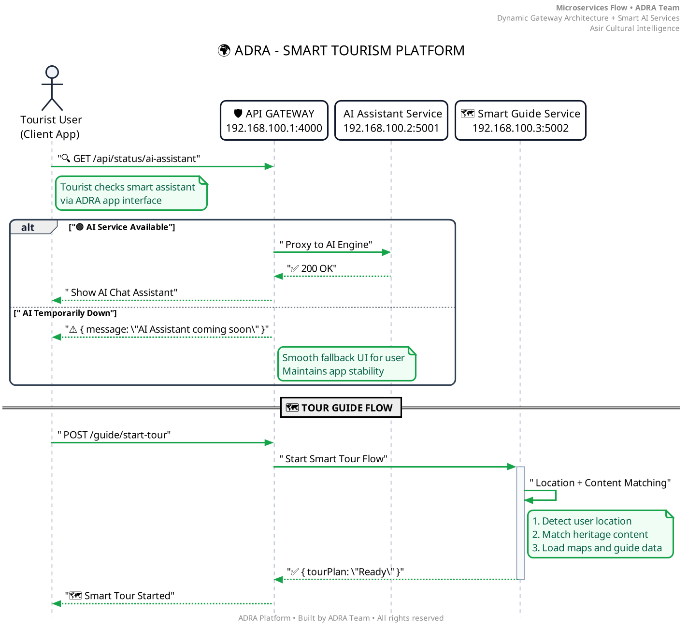

<div align="center">

 <!-- Logo and Title -->
<p align="center">
  
</p>

<h1 align="center">
  <span style="background: linear-gradient(90deg, #2563eb, #059669); -webkit-background-clip: text; -webkit-text-fill-color: transparent;">
    ADRA
  </span>
</h1>

<p align="center"><strong>The Future of Smart Cultural Tourism in Asir</strong></p>

<!-- Badges -->
<p align="center">
  <a href="https://aseertabtaker.asda.gov.sa/" target="_blank">
    
  </a>

  <a href="#-current-status">
    
  </a>

  <a href="LICENSE" target="_blank">
    
  </a>
  
  <a href="https://reactjs.org/" target="_blank">
    
  </a>
  
  <a href="https://nodejs.org/" target="_blank">
    
  </a>
  
  <a href="https://www.typescriptlang.org/" target="_blank">
    
  </a>
</p>

  <p>A next-generation AI-powered tourism ecosystem connecting travelers, guides, and artisans across Asir.</p>

  <hr />
</div>

## 🌐 Overview

**ADRA** is Saudi Arabia’s first comprehensive **cultural tourism ecosystem**, born in the heart of **Asir**, blending **AI-powered services**, **local storytelling**, and **community empowerment**.

From intelligent multilingual guides to a direct marketplace for artisans, ADRA isn’t just a travel app — it’s a **sustainable tourism movement**.

> 🏛️ *Built for* **Asir Hackathon 2025**
> 🎯 *Mission:* Empower local voices. Elevate authentic experiences. Preserve heritage.

---

## 🚀 Key Features

| ✨ Feature                          | 🔧 Technology                                         | 🌍 Impact                                     |
| ---------------------------------- | ----------------------------------------------------- | --------------------------------------------- |
| **AI + Human Hybrid Guide**        | GPT-level NLP, voice chat, contextual awareness       | Personalized tours with smart assistance      |
| **Live Translation Engine**        | Real-time speech/text (Arabic ↔ 6+ languages)         | Remove language barriers instantly            |
| **Cultural Experience Booking**    | Calendar API, geolocation, dynamic pricing            | Promote heritage & eco-tourism                |
| **Artisan Marketplace**            | Secure payments, inventory APIs, seller dashboards    | Economic inclusion for local artisans         |
| **Smart Discovery Engine**         | AI recommendations based on weather, trends, behavior | Meaningful visits tailored to context         |
| **Heritage AR Experience**         | ARKit/ARCore, 3D modeling, CV                         | Interactive learning at historical sites      |
| **Artisan–Tourist Direct Connect** | Messaging, video calls, booking system                | Bridge cultures through real conversations    |
| **Virtual Craft Workshops**        | Live streaming, VR/AR, payment gateway                | Share traditional crafts globally             |
| **Local Guide Network**            | GPS, ratings, multilingual support                    | Community-powered, authentic guidance         |
| **Cultural Event Discovery**       | AI, calendar sync, geolocation                        | Maximize cultural immersion                   |
| **Heritage Site Explorer**         | Interactive maps, audio, historical content           | Preserve & share cultural history digitally   |
| **Instant Chat with Locals**       | WebSocket, translation, content filtering             | Authentic, direct connection with locals      |
| **Experience Shorts (Videos)**     | Video editing, recommendation engine                  | Inspire & guide others through shared stories |
| **24/7 Personal Assistant (DARA)** | Concierge AI, emergency aid, bookings                 | Worry-free cultural exploration               |
| **Traditional Marketplace**        | Artisan profiles, secure checkout                     | Promote crafts and preserve identity          |

---

## 👥 Who Uses ADRA?

| 🧑 Role                               | 🎯 Purpose                                                                |
| ------------------------------------- | ------------------------------------------------------------------------- |
| 🧳 **Tourist / Traveler**             | Discover authentic heritage, book, translate, and share cultural journeys |
| 🧕 **Local Guide**                    | Offer local tours, monetize expertise, co-pilot with AI                   |
| 🧑‍🎨 **Artisan / Craftsperson**      | Sell crafts, host global workshops, preserve traditional skills           |
| 👨‍👩‍👧‍👦 **Local Families**        | Share traditions, host visitors, generate income                          |
| 🎭 **Event Organizer**                | Promote festivals, manage audiences, offer immersive experiences          |
| 🏛️ **Site Owner / Heritage Manager** | Enhance visitor journeys with AR, manage flow, digitize heritage          |
| 📱 **Content Creator**                | Build audiences through storytelling, monetize cultural content           |
| 🎓 **Cultural Educator**              | Teach traditions, host virtual classes, archive knowledge                 |
| 🏨 **Tourism Business**               | Curate authentic packages, partner with locals, improve guest offerings   |
| 🌍 **Global Enthusiast**              | Learn remotely, engage virtually, plan immersive future trips             |

---

## 🔮 What Makes ADRA Different?

* **Multilingual AI** meets **local expertise**
* **In-person + virtual** cultural immersion
* **Economic empowerment** for artisans & guides
* **AR/VR innovation** in tourism
* **Heritage preservation** through storytelling & tech

---

## 🏗️ Architecture at a Glance

ADRA follows a **scalable microservices architecture**, designed for cloud deployment and future extensibility.

<div align="center">
  
  <p><em>API Gateway orchestrates secure communication between frontend, microservices, and AI engines.</em></p>
</div>

---

## 💻 Tech Stack

### Frontend
- **Framework**: React 18 + Vite
- **Styling**: Tailwind CSS + Headless UI
- **Language**: TypeScript
- **State**: Zustand + React Query

### Backend & Services
- **Runtime**: Node.js (TypeScript)
- **Server**: Express + Fastify (hybrid)
- **Services**: Chat AI, Translation, Booking, Payments, Notifications
- **Auth**: JWT + OAuth2 (Google/Apple)

### AI & Intelligence
- **NLP Engine**: Fine-tuned LLM (Arabic + tourism domain)
- **Translation**: Real-time Whisper-like speech + text models
- **Recommendation Engine**: Collaborative filtering + location context

### DevOps & Scalability
- **Containerized**: Docker + Kubernetes-ready
- **CI/CD**: GitHub Actions (coming soon)
- **Monitoring**: Prometheus + Grafana (planned)

---

## 📁 Project Structure

```bash
ADRA/
├── Frontend/           # React + Vite (responsive PWA)
├── Backend/            # API Gateway + services
├── Services/           # Microservices (auth, booking, chat-ai, etc.)
├── Prototype/          # Design assets and tested UI components
├── Documents/          # Architecture PDFs, flows, brief, pitch deck
├── images/             # Assets, diagrams, branding
└── README.md           # You are here
```

---

## 📚 Documentation

| Document | Link |
|--------|------|
| 📄 Project Brief (Arabic) | [View PDF](Documents/ADRA%20Final.pdf) |
| 📊 System Architecture | [Diagrams](Documents/) |
| 🔁 Service Flow Diagrams | [Sequence & UML](Documents/) |
| 🎨 UI/UX Prototype | [Figma Preview](https://www.figma.com/file/your-link-here) |
| 📈 Pitch Deck | [Download (PDF)](Documents/pitch-deck.pdf) |

> 📁 All assets are stored and version-controlled in `/Documents`, `/Prototype`, and `/images`.

---

## 🚧 Current Status

| Component        | Status                 |
|------------------|------------------------|
| ✅ Prototype      | Complete               |
| 🔧 Backend        | In Progress (60%)      |
| 🔧 Services       | In Progress (50%)      |
| 📄 Documents      | In Progress (80%)      |
| 🎨 Frontend       | In Progress (70%)      |
| 🧠 AI Agent       | Planned                |
| 🛒 Marketplace MVP| Under Testing          |
| 🚀 Pilot Launch | Planned for Q3 2025 (Asir Region) |


---

## 📜 License

This project is licensed under a custom **All Rights Reserved** license.  
See [LICENSE](./LICENSE) for full legal terms.

---

<div align="center">

  <p><strong>ADRA</strong> — <em>Where Heritage Meets Intelligence</em></p>
  
  
  
  <p>Built with passion by innovators who believe tourism should be <strong>smart, sustainable, and human-centered</strong>.</p>
</div>
